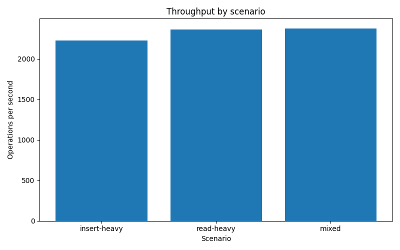
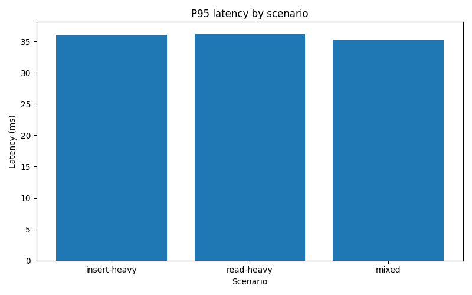
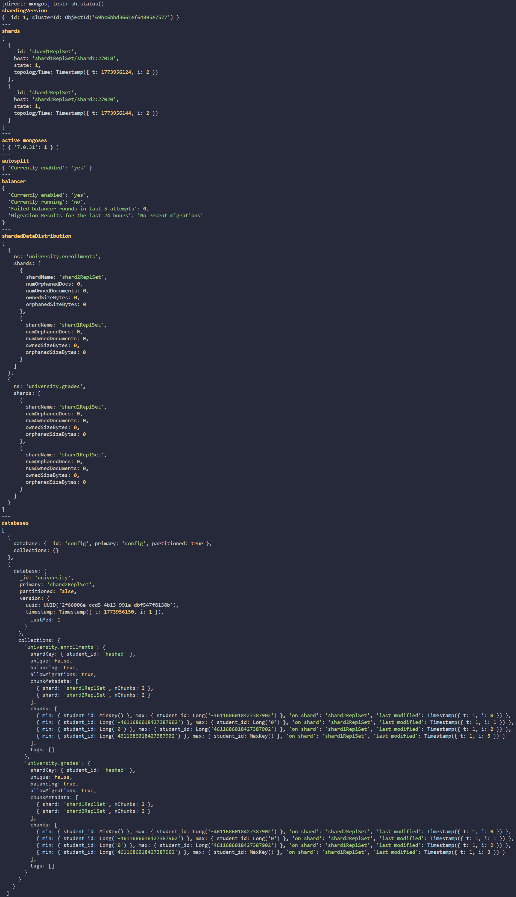
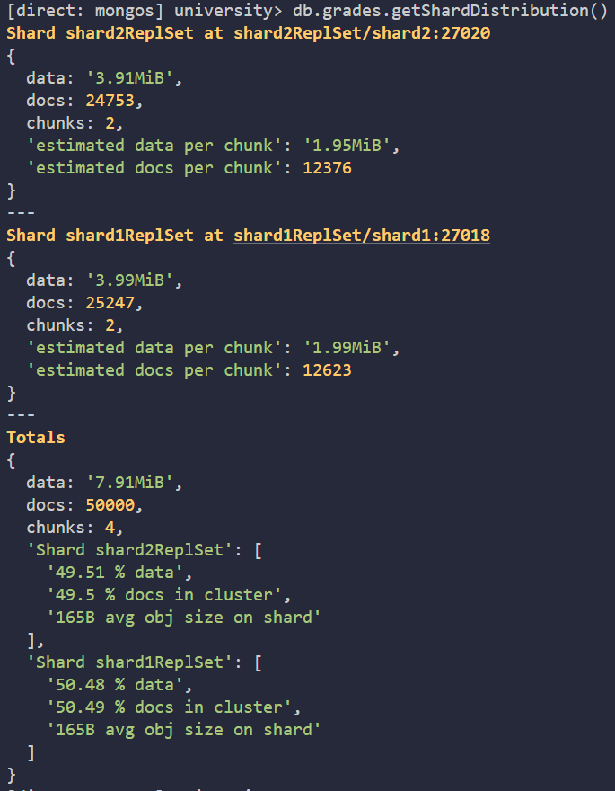
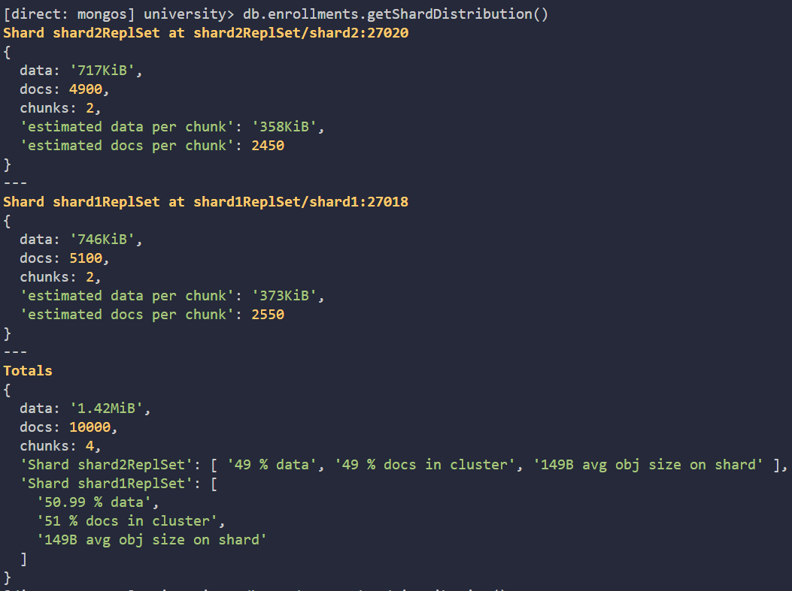
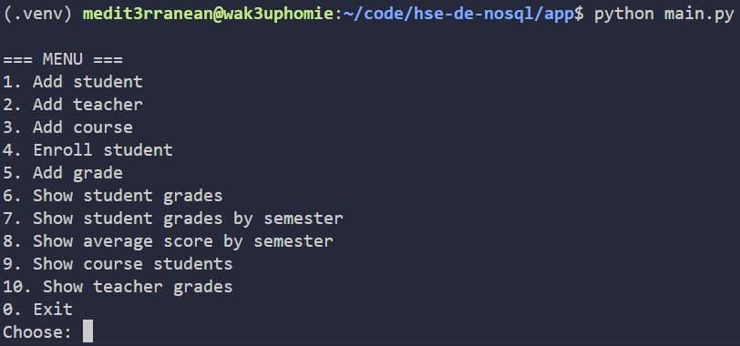
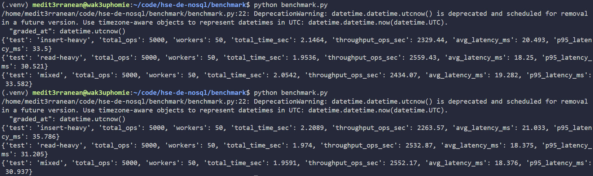

# hse-de-nosql

# Отчёт по итоговому проекту по дисциплине «Нереляционные базы данных»

Иван Кононенко

---

- **MongoDB 7**
- **Docker Compose**
- **Python 3**
- **PyMongo**
- **Faker**
- **Pandas**
- **Matplotlib**

---

### MongoDB Sharded Cluster:

- **config server replica set** — хранение конфигурации кластера;
- **shard1 replica set** — первый шард;
- **shard2 replica set** — второй шард;
- **mongos** — маршрутизатор запросов.

Таким образом, приложение и нагрузочный тест работают не напрямую с отдельными экземплярами MongoDB, а через `mongos`, что соответствует логике работы распределённого кластера.

Для учебного проекта данная конфигурация является удачным компромиссом между реалистичностью и сложностью реализации:

- кластер является действительно шардированным;
- присутствует маршрутизация через `mongos`;
- данные могут быть распределены между несколькими шардами;
- архитектура остаётся достаточно компактной для локального запуска на одном компьютере.

---

### Основные коллекции

В базе данных используются пять коллекций:

1. `students`
2. `teachers`
3. `courses`
4. `enrollments`
5. `grades`

Ниже приведено назначение каждой коллекции.

#### Коллекция `students`

Содержит сведения о студентах университета.

```json
{
  "student_id": "S1001",
  "full_name": "Иванов Иван Иванович",
  "group": "PI-23-1",
  "faculty": "Faculty of Informatics",
  "enrollment_year": 2023,
  "email": "ivanov@example.com",
  "birth_date": "2005-04-17"
}
```

#### Коллекция `teachers`

Содержит сведения о преподавателях.

```json
{
  "teacher_id": "T101",
  "full_name": "Петров Пётр Петрович",
  "department": "Computer Science",
  "email": "petrov@example.com",
  "position": "professor"
}
```

#### Коллекция `courses`

Содержит данные об учебных курсах.

```json
{
  "course_code": "C101",
  "title": "Databases",
  "department": "Computer Science",
  "credits": 4,
  "hours": 144
}
```

#### Коллекция `enrollments`

Содержит сведения о записи студентов на курсы.

```json
{
  "student_id": "S1001",
  "course_code": "C101",
  "semester": "2025-fall",
  "teacher_id": "T101",
  "enrolled_at": "2026-03-20T10:15:00Z",
  "status": "active"
}
```

#### Коллекция `grades`

Содержит результаты оценивания.

```json
{
  "student_id": "S1001",
  "course_code": "C101",
  "semester": "2025-fall",
  "teacher_id": "T101",
  "assessment_type": "exam",
  "score": 90,
  "graded_at": "2026-03-20T12:30:00Z"
}
```

---

### Логика разделения коллекций

Коллекции `students`, `teachers` и `courses` являются в основном справочными. Они используются как источники основных сведений о сущностях и не предполагают экстремально высокой интенсивности записи.

Коллекции `enrollments` и `grades` представляют собой операционные данные:

- они пополняются значительно чаще;
- именно они участвуют в большинстве пользовательских запросов;
- именно они быстрее всего растут в объёме.

Поэтому именно эти коллекции были выбраны в качестве кандидатов на шардинг.

---

### Индексы

Для повышения эффективности запросов были созданы следующие индексы:

- `students(student_id)` — уникальный индекс;
- `teachers(teacher_id)` — уникальный индекс;
- `courses(course_code)` — уникальный индекс;
- `enrollments(student_id, semester)` — составной индекс;
- `enrollments(course_code, semester)` — составной индекс;
- `enrollments(teacher_id, semester)` — составной индекс;
- `grades(student_id, semester)` — составной индекс;
- `grades(course_code, semester)` — составной индекс;
- `grades(teacher_id, semester)` — составной индекс;
- `grades(student_id, course_code, semester)` — составной индекс.

Такая схема индексации соответствует основным сценариям доступа к данным, а именно:

- получение оценок конкретного студента;
- получение оценок студента за заданный семестр;
- вычисление среднего балла студента;
- поиск студентов, записанных на конкретный курс;
- получение оценок, выставленных конкретным преподавателем.

---

### Выбор шардируемых коллекций

Для шардинга были выбраны две коллекции:

- `enrollments`
- `grades`

Выбор обусловлен тем, что именно они:

- содержат основной поток операционных данных;
- активно пополняются в процессе работы системы;
- участвуют в нагрузочном тестировании;
- наиболее естественно масштабируются горизонтально.

Коллекции `students`, `teachers` и `courses` не шардировались, поскольку их объём растёт существенно медленнее, а частота записи значительно ниже.

---

### Выбор shard key

Для обеих шардируемых коллекций был выбран shard key:

```javascript
{ student_id: "hashed" }
```

Шардинг был настроен командами:

```javascript
sh.addShard("shard1ReplSet/shard1:27018")
sh.addShard("shard2ReplSet/shard2:27020")
sh.enableSharding("university")
sh.shardCollection("university.enrollments", { student_id: "hashed" })
sh.shardCollection("university.grades", { student_id: "hashed" })
```

Для коллекций `enrollments` и `grades` в качестве shard key было выбрано поле `student_id`. Это связано с тем, что большая часть запросов в системе относится именно к конкретному студенту. В первую очередь это просмотр оценок, выборка оценок за семестр, подсчёт среднего балла и получение списка курсов, на которые записан студент. Поэтому `student_id` здесь является наиболее естественным полем для распределения данных.

Кроме того, это поле есть сразу в обеих коллекциях, которые были выбраны для шардинга. Благодаря этому удалось использовать одинаковый подход для `enrollments` и `grades`, не усложняя структуру базы и её настройку.

Также был выбран именно хешированный ключ — `{ student_id: "hashed" }`. Такой вариант лучше подходит для равномерного распределения документов по шардам. При обычном диапазонном разбиении данные с близкими значениями ключа могли бы попадать на один и тот же шард, что со временем привело бы к перекосу нагрузки. Хеширование позволяет этого избежать и делает распределение более сбалансированным.

В рамках данного проекта такой выбор оказался наиболее удачным: он соответствует логике предметной области, хорошо подходит под основные запросы и при этом достаточно прост в реализации.

Настройка шардинга выполнялась в следующей последовательности:

1. запуск контейнеров Docker Compose;
2. инициализация replica set для config server;
3. инициализация replica set для первого шарда;
4. инициализация replica set для второго шарда;
5. подключение шардов к маршрутизатору `mongos`;
6. включение шардинга для базы данных `university`;
7. шардинг коллекций `enrollments` и `grades`.

После выполнения этих шагов была выполнена проверка с помощью:

```javascript
sh.status()
```

Дополнительно распределение документов по шардам проверялось командами:

```javascript
db.enrollments.getShardDistribution()
db.grades.getShardDistribution()
```

---

### Инструмент тестирования

Для тестирования был реализован собственный Python-скрипт `benchmark.py`. Скрипт работает с MongoDB через `PyMongo` и использует пул потоков (`ThreadPoolExecutor`) для имитации параллельной нагрузки.

Были реализованы три сценария:

#### 1. Insert-heavy
Сценарий интенсивной записи.  
Выполняется массовая вставка документов в коллекцию `grades`.

#### 2. Read-heavy
Сценарий интенсивного чтения.  
Выполняются многочисленные запросы чтения оценок по `student_id`.

#### 3. Mixed
Смешанный сценарий.  
Около 70% операций составляют операции чтения и около 30% — операции записи.


В тестовой конфигурации использовались следующие параметры:

- количество операций на сценарий: **5000**;
- количество потоков: **50**.

В процессе тестирования собирались следующие метрики:

- `total_time_sec` — общее время выполнения сценария;
- `throughput_ops_sec` — пропускная способность, операций в секунду;
- `avg_latency_ms` — средняя задержка одной операции;
- `p95_latency_ms` — 95-й процентиль задержки.

Использование 95-го процентиля особенно важно, поскольку он отражает поведение системы в “тяжёлой” части распределения задержек и лучше показывает качество работы под нагрузкой, чем простое среднее значение.

Результаты тестирования сохраняются в файл `benchmark/results.csv`

Далее отдельный скрипт `plot_results.py` строит графики:

- `benchmark/throughput.png`
- `benchmark/p95_latency.png`

| Сценарий      | Операций | Потоков | Общее время, сек | Throughput, ops/sec | Avg latency, ms | P95 latency, ms |
|---------------|----------|---------|------------------|---------------------|-----------------|-----------------|
| insert-heavy  | 5000      | 50     | 2.2444              | 2227.74                 | 21.377             | 36.084             |
| read-heavy    | 5000      | 50     | 2.1147              | 2364.35                 | 19.949             | 36.273             |
| mixed         | 5000      | 50     | 2.1019              | 2378.75                 | 19.598             | 35.261             |

1. **Сценарий чтения** обычно показывает наиболее высокую пропускную способность и наименьшие задержки, поскольку операции `find()` с использованием индексов выполняются быстрее массовых вставок.

2. **Сценарий записи** характеризуется более высокой нагрузкой на кластер, так как каждая вставка требует фактической записи новых документов в коллекцию `grades`.

3. **Смешанный сценарий** отражает более реалистичную рабочую нагрузку. Его показатели обычно располагаются между read-heavy и insert-heavy.

4. Наличие шардинга позволяет распределить данные и нагрузку между двумя шардами, что делает архитектуру масштабируемой и более устойчивой к росту объёма операционных данных.

Пропускная способность

```markdown

```

95-й процентиль задержки

```markdown

```


### Скриншоты работы проекта

```markdown






```